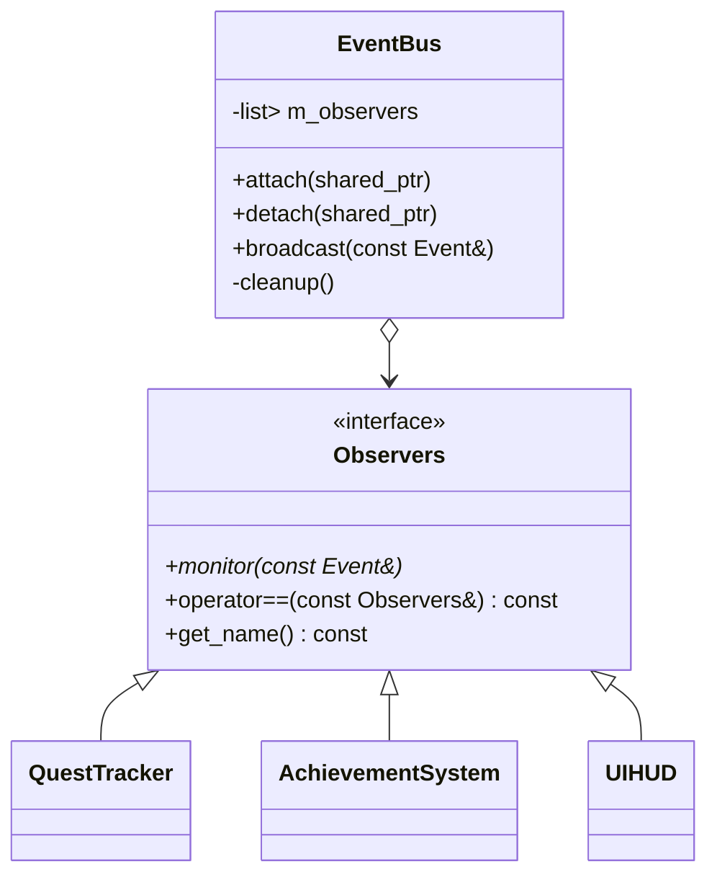

# 观察者（Observer）

## 1. 核心概念
- **Subject / Observable（被观察者）**：负责维护观察者列表，提供注册、注销、通知等接口。
- **Observer（观察者）**：定义统一回调接口（如 `monitor(const Event&)`），由具体系统实现。
- **事件流**：被观察者产生事件（`Event`），并广播给所有有效观察者，每个观察者可根据事件类型做出处理。

## 2. 代码结构（EventBus + 观察者）


### 2.1 事件结构体
```cpp
struct Event {
    std::string type;     // 事件类型，如 enemy_defeated
    std::string payload;  // 负载，可放额外信息
};
```

### 2.2 观察者基类
- 使用 `using Observers::Observers;` 让派生类自动继承构造函数。
- `operator==` 通过名称比较，实现“去重”需求。

### 2.3 EventBus 设计要点
1. **存储容器**： `std::list<std::weak_ptr<Observers>>`  
   - `weak_ptr` 防止 `EventBus` 与观察者之间的循环引用。
   - `list` 便于在遍历时安全增删元素。
2. **attach**
   - 先 `cleanup()` 去除已销毁观察者。
   - 遍历 `weak_ptr`，`if (auto locked = weak.lock())`：升级为 `shared_ptr`，同时检查是否与新观察者同名；若同名直接返回。
   - 不同名则 `m_observers.emplace_back(observer);`
3. **detach**
   - `remove_if` + lambda：  
     ```cpp
     m_observers.remove_if([&](const std::weak_ptr<Observers> &weak) {
         auto locked = weak.lock();
         return !locked || (*locked == *observer);
     });
     ```
   - 注意 `[&]` 捕获，因为需要访问外部变量 `observer`。
4. **broadcast**
   - 再次 `cleanup()`，确保只给有效观察者推送。
   - 遍历 `weak_ptr`，成功 `lock()` 后调用 `monitor(event)`。
5. **cleanup**
   - `m_observers.remove_if([](const std::weak_ptr<Observers>& weak) { return weak.expired(); });`
   - 因未访问外部变量，捕获列表用 `[]`。

## 3. 智能指针与 `weak_ptr`
- `shared_ptr` + `shared_ptr` 互相持有会产生强引用环，导致对象永不析构。
- `EventBus` 需要“知道”观察者，但不拥有其生命周期 ⇒ 选 `weak_ptr`。
- `weak.lock()`：尝试获取 `shared_ptr`。  
  - 成功 ⇒ 对象仍然存在，可安全访问。  
  - 失败 ⇒ 对象已销毁，返回空指针。
- `if (auto locked = weak.lock()) { ... }`：在 `if` 语句里声明局部变量 `locked`，只有当 `weak` 有效时才进入。

## 4. Lambda 捕获讲解
- **为什么要捕获？** Lambda 默认不能使用外部变量，必须把需要的变量“带进来”。
- **常用写法**：
  - `[]`：不捕获任何外部变量；只能用参数。
  - `[=]`：按值复制所有外部变量，函数体里使用副本。
  - `[&]`：按引用捕获所有外部变量，函数体里直接访问原对象。
  - `[x]` / `[&x]`：只捕获指定变量（值 / 引用）。
  - `[=,&x]`：默认按值，但 `x` 例外按引用。
- **示例**：
  ```cpp
  // 只能访问 weak
  m_observers.remove_if([](const std::weak_ptr<Observers>& weak) { return weak.expired(); });
  
  // 需要访问 observer ⇒ 捕获引用
  m_observers.remove_if([&](const std::weak_ptr<Observers>& weak) {
      auto locked = weak.lock();
      return !locked || (*locked == *observer);
  });
  ```

## 5. `remove_if` 详解
1. **成员版（如 `std::list::remove_if`）**
   - 语法：`list.remove_if(Predicate pred);`
   - 自动遍历，`pred(element)` 返回 `true` 的元素会被删除，不需要 `erase`。
   - 例：  
     ```cpp
     m_observers.remove_if([&](const std::weak_ptr<Observers>& weak) {
         auto locked = weak.lock();
         return !locked || (*locked == *observer);
     });
     ```
2. **算法版（适用于 `vector` 等）**
   - 语法：`auto newEnd = std::remove_if(begin, end, pred);`
   - 只把“要删”的元素挪到尾部并返回新末尾，必须再 `container.erase(newEnd, container.end());`
   - 例：  
     ```cpp
     auto newEnd = std::remove_if(vec.begin(), vec.end(), [](int x){ return x % 2 == 0; });
     vec.erase(newEnd, vec.end());
     ```

## 6. 练习题实现提示
- 构造 `QuestTracker`、`AchievementSystem`、`UIHUD` 三个观察者。
- 在 `observer_test()` 中注册、广播、注销，验证行为：
  1. 多次 `enemy_defeated` ⇒ `QuestTracker` 输出“task finished!”（5 次触发）。
  2. 多次 `rare_items_collected` ⇒ `AchievementSystem` 输出“nice collected!”（3 次触发）。
  3. `UIHUD` 输出“type:..., payload:...”，注销后不再输出。
- 重点体验：
  - `EventBus` 中 `weak_ptr` 的使用；
  - `remove_if` 清理逻辑；
  - Lambda 捕获写法；
  - `using Observers::Observers;` 继承构造函数的方便性。

## 7. 调试与排错清单
1. **重复注册**：`operator==` 基于名字去重，确保传入名称唯一或按需共享。
2. **崩溃/空指针**：多数是 `weak_ptr` 已失效却仍然解引用，务必用 `if (auto locked = weak.lock())`。
3. **Lambda 捕获错误**：报“变量未定义”时检查捕获列表；用 `[&]` 时注意生命周期。
4. **`remove_if` 无效**：成员版无需 `erase`，算法版必须配合 `erase`；确认 `pred` 是否返回正确布尔值。

---

通过以上总结，复习时可快速回顾 Observer 模式结构、智能指针与 `weak_ptr` 的使用、lambda 捕获语法、`remove_if` 的两种形式以及具体游戏事件中心示例，做到理解与实践兼顾。